# Projet Yggdrasil

[Présentation](#présentation) | [Matériel](#matériel) | [Expérimentations](#expérimentations)

---

## Présentation

Le but de notre projet est d’utiliser un **Raspberry Pi** pour surveiller une plante automatiquement. Notre idée principale est de créer un **système intelligent** capable de récupérer des informations sur l’environnement de la plante, d’analyser son état et de réagir s’il y a un problème, afin de l’aider à rester en bonne santé sans avoir besoin d’intervention constante.

Dans un premier temps, on utilise un **capteur de luminosité** pour mesurer la quantité de lumière autour de la plante. Cela permet de vérifier si elle reçoit assez de lumière ou si elle est dans un endroit trop sombre. En fonction des valeurs obtenues, le système peut donner une indication à l’utilisateur pour améliorer la situation, par exemple en déplaçant la plante.

Dans un deuxième temps, on utilise une **caméra** pour prendre des photos de la plante à intervalles réguliers, comme toutes les 15 minutes. Les images sont automatiquement enregistrées dans le système, ce qui permet de suivre l’évolution de la plante sans avoir besoin de la surveiller en permanence.

Dans un troisième temps, toutes ces images sont utilisées pour créer une vidéo <mark>time-lapse</mark> grâce à **ffmpeg**. Cette vidéo permet de voir la croissance de la plante en accéléré, ce qui rend les changements beaucoup plus visibles et faciles à analyser.

Dans un quatrième temps, on utilise **OpenCV** pour analyser les images automatiquement. Par exemple, on peut détecter des changements dans la couleur des feuilles, comme du vert vers du jaune. Cela permet au système de donner des indications sur l’**état de santé de la plante**.

Finalement, le projet **Yggdrasil** lie plusieurs technologies comme des capteurs, une caméra, du traitement d’images, du stockage de données, une interface web et de l’automatisation dans le but de créer un <mark>système complet, intelligent et autonome</mark> pour la surveillance des plantes.


---

## Matériel

### Technologie 1 — Raspberry PI

| Champ | Détail |
|-------|--------|
| **Fabricant** | Raspberry Pi Foundation |
| **Modèle** | Raspberry Pi 4 Model B 4GB RAM |
| **Spécifications** | Le Raspberry Pi 4 Model B est équipé d’un processeur quad-core Cortex-A72 64 bits cadencé à 1,5 GHz, de 4 Go de RAM LPDDR4, du Wi-Fi 802.11 b/g/n/ac, du Bluetooth 5.0, de ports USB 3.0 et 2.0, de deux ports micro HDMI qui peut supporter jusqu’à 4K, d’un port Ethernet Gigabit et des broches GPIO pour connecter des capteurs. Voici un lien pour la documentation du Raspberry PI :  |
| **Usage prévu** | On se sert du Raspberry PI comme système principal du projet pour lire les capteurs, contrôler une caméra, traiter les données et héberger sur notre serveur web |
| **Justification du choix** | Le Raspberry Pi a été choisi parce qu’il est simple à utiliser, peu coûteux et très polyvalent. Il permet de connecter facilement différents capteurs et une caméra grâce aux broches GPIO, ce qui est essentiel pour notre projet. De plus, il est assez puissant pour exécuter plusieurs programmes en même temps comme la lecture des capteurs, le traitement d’images avec OpenCV et l’hébergement d’un serveur web. C’est aussi un outil vraiment populaire dans les projets informatiques dont il existe beaucoup de documentation et d’exemples pour nous aider en cas de problème. Finalement, sa petite taille et sa faible consommation en énergie en font une solution pratique pour un petit système qui doit fonctionner en continuellement. |
| **Lien vers la documentation** | [Fiche technique du Raspberry Pi](https://www.raspberrypi.com/products/raspberry-pi-4-model-b/specifications/) |
| **Expérimenté par** | Maxime Michaud |

### Technologie 2 — Raspberry PI Camera Module 3

| Champ | Détail |
|-------|--------|
| **Fabricant** | Raspberry Pi Foundation |
| **Modèle** | Raspberry PI Camera Module 3 |
| **Spécifications** | Caméra de 12 mégapixels (Sony IMX708), support de l’autofocus, capture d’images et de vidéos HD, compatibilité avec le Raspberry Pi via le port CSI. Elle a aussi un sensor diagonal large de 7.4mm et une angle de vue de 75 degrès |
| **Usage prévu** | La caméra est utilisée pour prendre des photos de la plante à intervalles réguliers. Ces images permettent de suivre son évolution dans le temps et de créer un time-lapse de sa croissance. On va l'utiliser pour l'expérimentation 2. |
| **Justification du choix** | Cette caméra de la même compagnie que notre première technologie a été choisie par notre équipe parce qu’elle est compatible directement avec le Raspberry Pi et facile à installer. Elle offre une bonne qualité d’image, ce qui est important pour observer les changements de la plante. En plus de ça, elle supporte l’autofocus, ce qui permet d’avoir des images plus claires sans ajustement manuel et elle est aussi bien documentée. |
| **Lien vers la documentation** | [Caméra Module 3 du Raspberry PI](https://www.raspberrypi.com/products/camera-module-3/) |
| **Expérimenté par** | Maxime Michaud |


### Technologie 3 — Capteur de luminosité (LDR)

| Champ | Détail |
|-------|--------|
| **Fabricant** | Générique (C'est un module compatible avec Arduino et Raspberry Pi) |
| **Modèle** | Capteur de luminosité LDR de type KY-018|
| **Spécifications** | C'est un capteur basé sur une photorésistance (LDR) qui varie sa résistance selon la lumière avec une sortie analogique ou numérique, une alimentation 3.3V ou 5V, 3 broches (VCC, GND, Signal) |
| **Usage prévu** | Le capteur de luminosité est utilisé pour mesurer la quantité de lumière autour de la plante. Il permet de déterminer si la plante reçoit assez de lumière ou si elle est dans un environnement trop sombre. On va l'utiliser pour l'expérimentation 1. |
| **Justification du choix** | Ce capteur est simple à utiliser, peu coûteux et efficace pour détecter les variations de luminosité. Il est idéal et parfait pour un projet comme celui-ci puisqu’il permet de prendre des décisions automatiques basées sur la lumière. |
| **Lien vers la documentation** | [KY-018 Module à photorésistance LDR](https://sensorkit.joy-it.net/fr/sensors/ky-018) |
| **Expérimenté par** | Alexandre Sweeney-Lantin |


---

## Expérimentations

### Expérimentation 1 — Test du capteur de luminosité

| Champ | Détail |
|-------|--------|
| **Réalisée par** | Alexandre Sweeney-Lantin |
| **Technologie(s)** | Arduino uno r3 et Capteur de luminosité (LDR) KY-018 |
| **Objectif** | Vérifier si le capteur de luminosité permet de mesurer correctement la quantité de lumière autour d'une plante et de déterminer si elle reçoit suffisamment de lumière pour sa croissance |

#### Contexte de réalisation

Cette expérimentation a été réalisée avec un Arduino Uno R3 à la place d'un Raspberry Pi, puisque le capteur de lumière utilisé est un capteur analogique et que l'Arduino possède des broches analogiques natives

1. J'ai branché le capteur sur l'Arduino Uno R3 : la broche **S** sur **A0** (fil bleu), le **+** sur **5V** (fil blanche) et le **–** sur **GND** (fil rouge).
2. Ensuite j'ai coder l'Arduino pour lire les valeurs du capteur et les afficher dans le moniteur série. 
3. J'ai fini par définir des seuils de luminosité pour classifier l'environnement de la plante :
   - <mark>trop sombre (&lt; 200)</mark>  
   - <mark>lumière faible (200–500)</mark>  
   - <mark>bonne lumière (500–800)</mark>  
   - <mark>plein soleil (&gt; 800)</mark>

#### Branchement Arduino
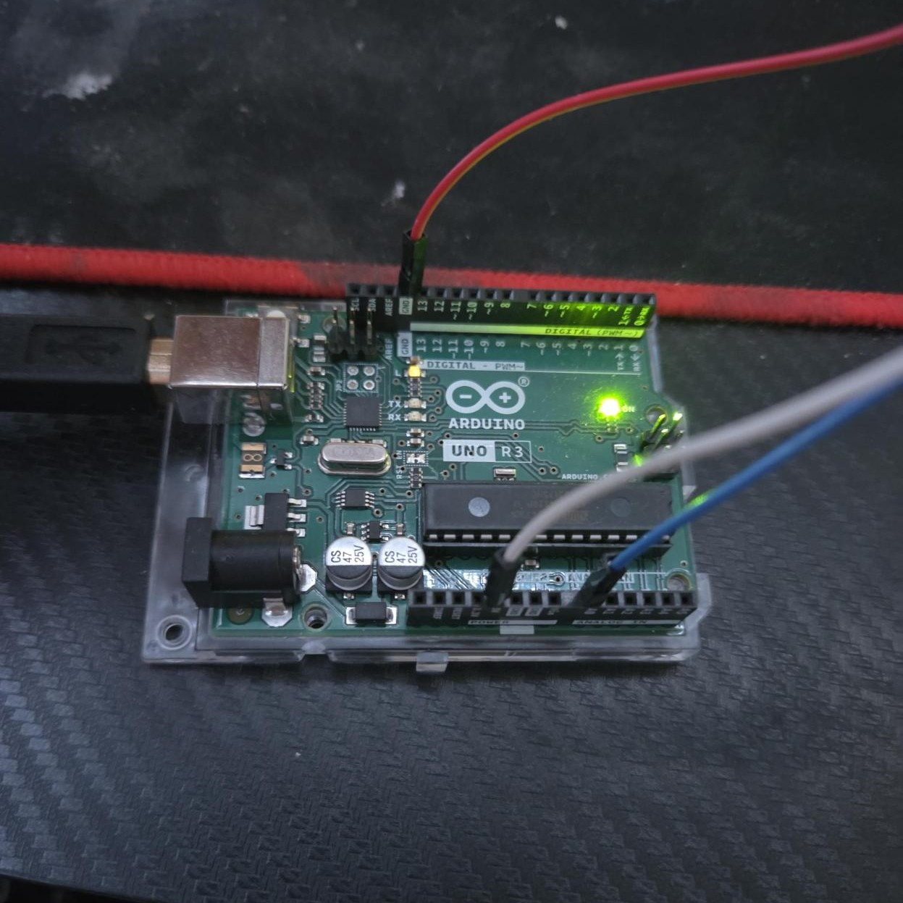

#### Branchement du capteur
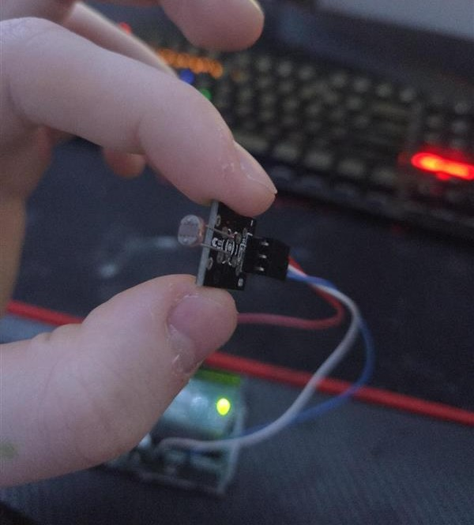

#### Vidéo de démonstration
Cette vidéo montre le montage en fonctionnement.

<video controls width="600">
  <source src="img/Alex/video.mp4" type="video/mp4">
</video>

#### Résultat

Le capteur fonctionne correctement et réagit bien aux variations de lumière. En couvrant le capteur avec le doigt, les valeurs <mark>chutent significativement</mark>, ce qui confirme qu'il détecte bien les changements de luminosité.  
Le système affiche un message indiquant l'état de la lumière pour la plante, par exemple "Bonne lumière" ou "Trop sombre".


#### Avis sur la technologie

- **Forces** : Le capteur est très simple à brancher, peu coûteux et <mark>réagit très bien aux changements de lumière</mark>
- **Faiblesses** : Contrairement au Raspberry Pi, l'Arduino ne peut pas envoyer des notifications automatiques
- **Potentiel** : Le capteur pourrait transmettre ses données à un Raspberry Pi pour <mark>envoyer des notifications automatiques</mark>
- **Limites** : Le capteur mesure uniquement la luminosité ambiante générale

#### Avis final

> **Validation de l'hypothèse** — L'expérimentation montre que le capteur est capable de <mark>mesurer la luminosité</mark> autour d'une plante et de donner des indications sur la quantité de lumière.

---

### Expérimentation 2 — Capture d’images avec la caméra 

| Champ | Détail |
|-------|--------|
| **Réalisée par** | Maxime Michaud |
| **Technologie(s)** | Raspberry Pi 4 Model B, Raspberry Pi Camera Module 3 (Sony IMX708) et bibliothèque Python **Picamera2** |
| **Objectif** | Vérifier si la Camera Module 3 permet de capturer automatiquement des images d’une plante à intervalles réguliers pour suivre son évolution dans le temps |

#### Contexte de réalisation

Cette expérimentation a été réalisée avec un **Raspberry Pi 4 Model B** sous **DietPi** (distribution basée sur Debian Trixie, minimaliste et orientée serveur headless) et une **Camera Module 3** branchée au port CSI. DietPi a été retenu pour sa légèreté et son contrôle fin des paquets installés, seuls les composants nécessaires sont présents, sans environnement graphique. Le but était de mettre en place un système de capture automatique d’images.

1. J’ai branché la Camera Module 3 au port CSI du Raspberry Pi en soulevant le clip, en insérant le câble ruban avec les <mark>contacts métalliques vers le côté opposé au clip</mark>, puis en refermant. C’est un détail important, un câble mal orienté empêche la détection.
2. Après un redémarrage, j’ai vérifié que la caméra était bien détectée avec la commande `rpicam-hello --list-cameras`. Sur Trixie, la caméra est <mark>auto-détectée</mark> grâce à `camera_auto_detect=1` activé par défaut dans `/boot/firmware/config.txt`, donc aucune étape dans raspi-config. La commande m’a confirmé la détection du capteur **imx708**.
3. J’ai testé une capture manuelle avec `rpicam-still -o test.jpg` pour m’assurer que tout fonctionnait.
4. DietPi étant une distribution minimaliste, aucune bibliothèque caméra n’est préinstallée. **Picamera2**, la bibliothèque officielle Python pour contrôler la caméra sur Raspberry Pi, a donc été installée manuellement via `sudo apt install python3-picamera2 --no-install-recommends`. Le flag `--no-install-recommends` est essentiel ici, il évite de tirer des dépendances liées à l’interface graphique (Qt, GTK, etc.) qui sont inutiles en contexte headless et alourdiraient considérablement le système.
5. J’ai écrit un script Python `capture.py` qui ouvre la caméra, active l’autofocus, prend une photo avec un nom contenant la <mark>date et l’heure</mark>, puis ferme la caméra. Voici le code :

```python
from picamera2 import Picamera2
from libcamera import controls
from datetime import datetime
import time
import os

output_dir = "/home/dietpi/captures"
os.makedirs(output_dir, exist_ok=True)

picam2 = Picamera2()
config = picam2.create_still_configuration(main={"size": (4608, 2592)})
picam2.configure(config)
picam2.start()
picam2.set_controls({"AfMode": controls.AfModeEnum.Continuous})
time.sleep(2)  # attendre que l’autofocus fasse la mise au point

filename = datetime.now().strftime("plante_%Y%m%d_%H%M%S.jpg")
filepath = os.path.join(output_dir, filename)
picam2.capture_file(filepath)

picam2.stop()
picam2.close()
```

6. Pour l’automatisation, j’ai utilisé un **crontab** au lieu d’une boucle infinie avec `time.sleep()`, parce qu’avec cron chaque exécution est indépendante et si le script plante une fois, la prochaine capture se fera quand même. J’ai ajouté cette ligne avec `crontab -e` pour capturer <mark>toutes les 15 minutes</mark> :

```
*/15 * * * * /usr/bin/python3 /home/dietpi/capture.py >> /home/dietpi/capture.log 2>&1
```

#### Photos / Vidéos

<!-- TODO: Ajouter les photos du montage et des exemples de captures dans img/Maxime/ -->

#### Résultat

La caméra capture des images en <mark>pleine résolution de 4608 x 2592 pixels</mark>. Chaque photo pèse entre 4 et 8 Mo en JPEG. À 96 images par jour (une toutes les 15 minutes), ça représente environ <mark>400 à 750 Mo par jour</mark>. Sur une carte SD de 32 Go, on a assez d’espace pour plusieurs semaines de captures.

L’autofocus par détection de phase (PDAF) fonctionne bien sur une plante. Les images sont nettes sans avoir besoin de régler quoi que ce soit manuellement. J’ai remarqué que l’autofocus pouvait hésiter un peu quand il y avait peu de contraste, mais en éclairage intérieur normal les résultats étaient bons. Ces images pourraient ensuite être réutilisées pour créer un time-lapse ou pour l’analyse avec OpenCV.

#### Avis sur la technologie

- **Forces** : La caméra est facile à brancher et Trixie la détecte automatiquement. L’autofocus est un vrai avantage, les images sont <mark>nettes sans ajustement manuel</mark>. Picamera2 est simple à utiliser en Python.
- **Faiblesses** : Le câble ruban est fragile et un mauvais branchement empêche la détection sans message d’erreur clair. Les images en faible luminosité sont bruitées.
- **Potentiel** : On pourrait ajouter un <mark>éclairage LED</mark> contrôlé par le Raspberry Pi pour avoir des conditions constantes et permettre les captures de nuit. Le mode HDR du capteur pourrait aussi aider dans les environnements avec un éclairage variable.
- **Limites** : Le stockage sur carte SD est limité sur le long terme, il faudrait prévoir un nettoyage automatique ou un transfert réseau. Pour la nuit, il faudrait la variante NoIR de la caméra avec un éclairage infrarouge.

#### Avis final 

> **Validation de l’hypothèse** — L’expérimentation montre que la Camera Module 3 et Picamera2 permettent de <mark>capturer automatiquement des images</mark> d’une plante à intervalles réguliers. Le système est autonome grâce au crontab et les images sont de bonne qualité grâce à l’autofocus.

---

### Expérimentation 3 — Génération d’un time-lapse avec ffmpeg 

| Champ | Détail |
|-------|--------|
| **Réalisée par** | Justin Lavigueur |
| **Technologie(s)** | - **ffmpeg** : logiciel en ligne de commande pour traiter des vidéos et images<br>- Images **PNG** prises avec mon téléphone sur ma plante de jade<br>- Mon ordinateur personnel avec **PowerShell**<br>- Un dossier local pour organiser mes images |
| **Objectif** | Vérifier s’il est possible de créer une vidéo <mark>time-lapse</mark> à partir d’une série de photos et observer si le résultat permet de visualiser l’évolution de la plante |


#### Contexte de réalisation en étapes

Cette expérimentation a été réalisée sur mon ordinateur après avoir installé **ffmpeg**. L’objectif était de transformer une série d’images en vidéo afin d’observer l’évolution de ma plante de jade.

1. Dans un premier temps, j’ai installé **ffmpeg** et vérifié son bon fonctionnement dans le terminal **PowerShell**.
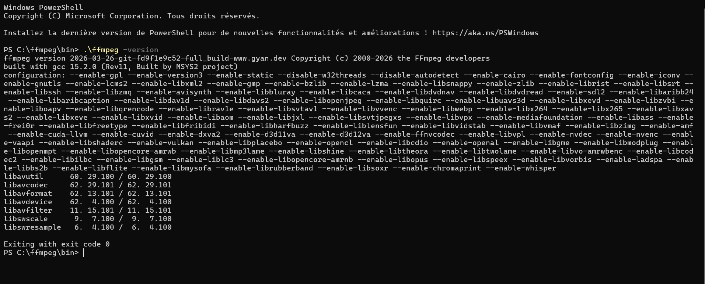

2. Dans un deuxième temps, j’ai pris plusieurs photos de ma plante en gardant le même angle et le même cadrage afin d’assurer une bonne continuité visuelle.

3. Ensuite, j’ai placé toutes les images dans un même dossier en les nommant dans un ordre précis (image1, image2, etc.).

4. Finalement, j’ai utilisé une commande **ffmpeg** pour transformer les images en vidéo MP4.  
J’ai réalisé deux tests : un avec <mark>20 images</mark> et un autre avec <mark>30 images</mark> afin de comparer les résultats.

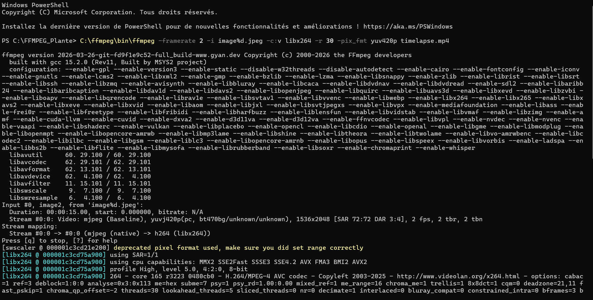
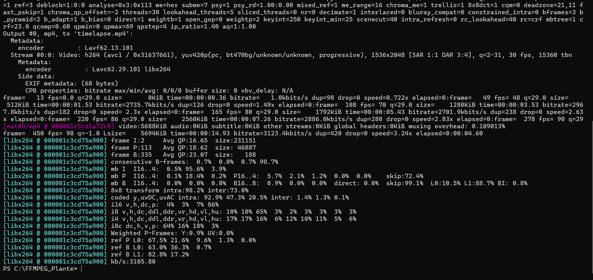


### Photos / Vidéos

#### Time-lapse avec 20 images

<video controls width="600">
  <source src="img/Justin/timelapse20.mp4" type="video/mp4">
</video>

#### Time-lapse avec 30 images

<video controls width="600">
  <source src="img/Justin/timelapse30.mp4" type="video/mp4">
</video>

#### Preuve de création

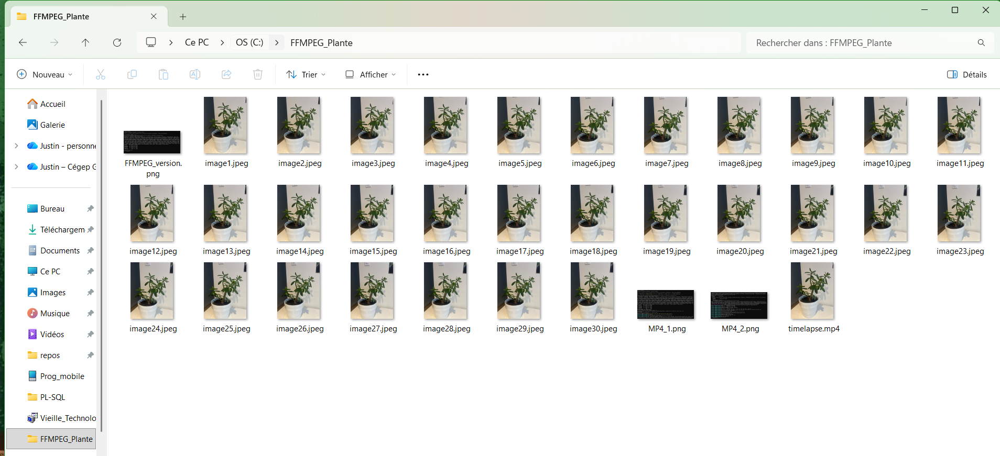


#### Résultat

Les deux vidéos ont été créées avec succès. Celle contenant <mark>30 images est plus fluide</mark> que celle avec 20 images, ce qui montre que le nombre d’images influence directement la qualité du time-lapse.  
Cependant, comme les photos ont été prises sur une courte période, les changements dans la plante sont peu visibles.

#### Avis sur la technologie

- **Forces** : **ffmpeg** est rapide, efficace et permet de créer facilement une vidéo à partir d’images. C’est aussi un outil gratuit.
- **Faiblesses** : L’outil n’est pas très intuitif au début puisqu’il fonctionne en ligne de commande.
- **Potentiel** : Cette technologie permettrait de générer automatiquement des vidéos sur plusieurs jours ou semaines.
- **Limites** : Le résultat dépend du nombre d’images et du temps entre chaque prise.

#### Avis final 

> **Validation de l'hypothèse** — Cette expérimentation démontre que **ffmpeg** permet de créer efficacement une vidéo <mark>time-lapse</mark>.  
> Les tests confirment que <mark>plus il y a d’images, plus la vidéo est fluide</mark>.

---


### Expérimentation 4 — Analyse d’images avec OpenCV

| Champ | Détail |
|-------|--------|
| **Réalisée par** | Antoine Bergeron |
| **Technologie(s)** | OpenCV et Visual Studio Code |
| **Objectif** | Comprendre le fonctionnement d'OpenCV et réussir à analyser l'évolution d'une plante dans le temps |


#### Contexte de réalisation

Cette expérimentation a été réalisée sur **Visual Studio Code** dans un projet Python utilisant <mark>OpenCV</mark>. Cette technologie permet d’analyser des images automatiquement. Justin a pris des images de sa plante de jade, j’ai donc utilisé OpenCV pour tenter d’analyser l’évolution de sa couleur et de sa taille. J’ai également fait un test image par image afin d’apprendre au programme à distinguer une plante du reste dans une photo, en détectant la couleur verte.

1. Installation d’OpenCV : dans le terminal du projet Python ou dans PowerShell avec la commande `pip install opencv-python`.
2. Installation de l’interface : `pip install matplotlib`. Cette installation permet d’afficher une interface avec un graphique représentant l’évolution des résultats.
3. Analyse d’une image : j’ai ensuite créé un projet nommé `analyse_image.py` qui permet d’analyser une image. Le programme distingue la plante du reste en détectant les couleurs présentes, principalement le vert. Il encadre ensuite la plante dans l’image. Ce test n’est pas forcément utile pour le projet final, mais il permet de comprendre le fonctionnement de la détection. Nous pourrons ensuite détecter des problèmes comme des taches, des changements de couleur ou des parties mortes. Comme il n’y avait aucun problème visible sur les photos actuelles, cette fonctionnalité n’a pas pu être testée complètement.
4. Analyse de l’évolution des couleurs : dans un deuxième programme nommé `analyse_couleur.py`, j’ai parcouru un dossier d’images pour analyser l’évolution de la couleur de la plante dans le temps. Le programme observe les variations du vert. Comme les images ont été prises la même journée, les résultats sont assez stables.
5. Analyse de l’évolution de la taille : dans un projet nommé `analyse_taille.py`, j’ai analysé la taille de la plante en fonction du nombre de pixels. Le programme parcourt les images et suit l’évolution de la taille. Cependant, comme les photos ont été prises avec un téléphone, les données sont imprécises à cause de l’angle, de la distance et de l’éclairage. Dans le projet final, une caméra fixe sera utilisée pour obtenir des données plus fiables.

---

#### Photos / Vidéos
Voici à quoi l'analyse d'une image de plante ressemble. Le rectangle vert sert à identifier la plante.: 
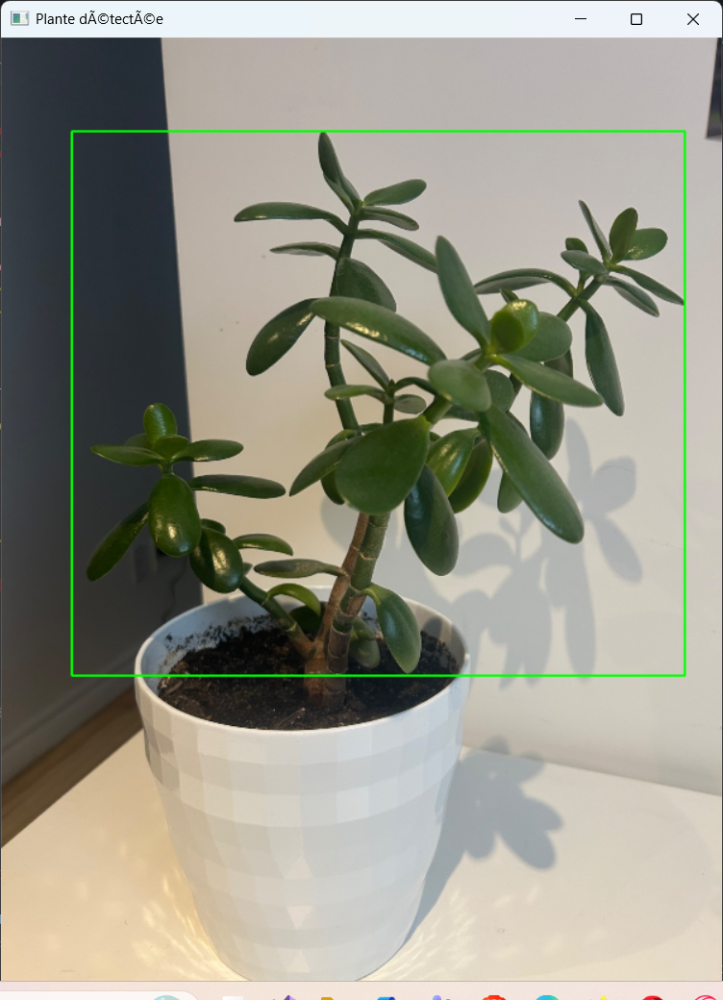

Voici à quoi ressemble le tableau de l'évolution des couleurs de la plante. : 
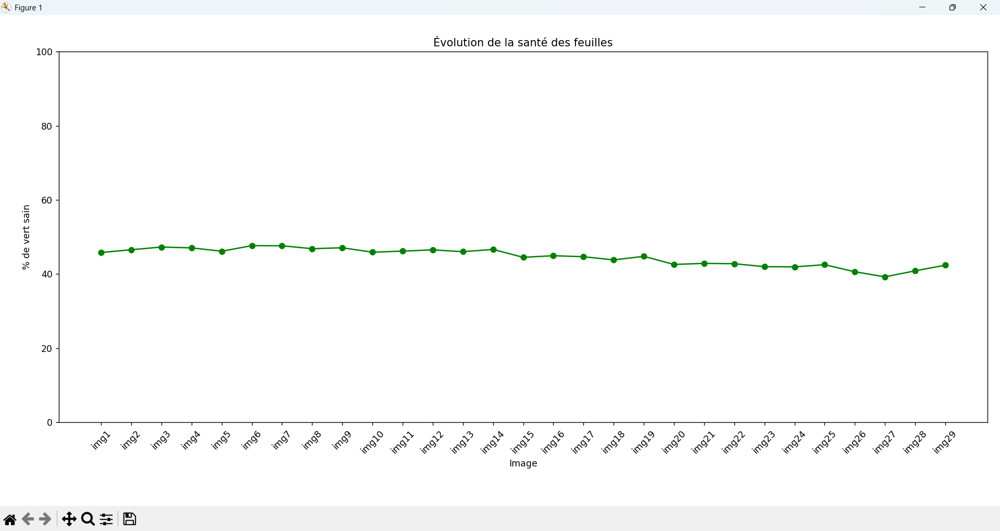

Voici à quoi ressemble le tableau de l'évolution de la taille de la plante. : 
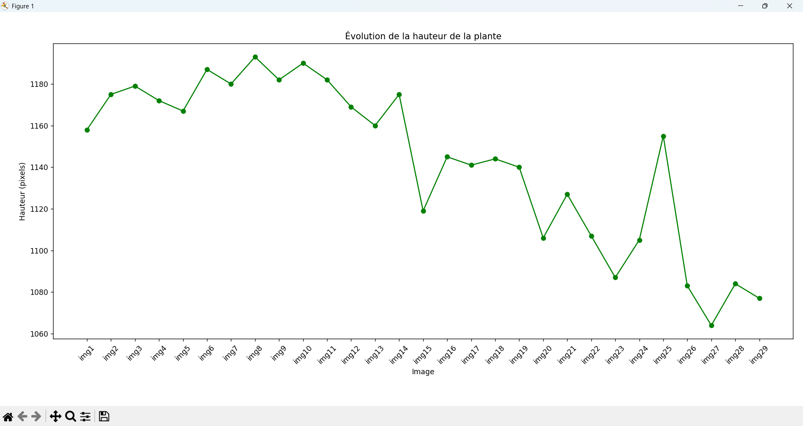


#### Résultat

Les tests ont fonctionné et permettent de suivre l’évolution de la plante. Cependant, comme les images ont été prises sur une courte période, les changements restent très limités.


#### Avis sur la technologie

- **Forces** : <mark>OpenCV</mark> permet d’analyser facilement les images. C’est une technologie assez intuitive et relativement simple à apprendre pour une première utilisation.
- **Faiblesses** : L’affichage des images est limité. L’image n’est pas toujours bien centrée et la taille doit être ajustée manuellement. Sur différents écrans, le rendu peut varier et ne s’adapte pas automatiquement.
- **Potentiel** : Sur une longue période et avec une configuration stable, l’évolution de la plante pourra être représentée de façon précise.
- **Limites** : Si les conditions de prise d’image ne sont pas constantes, les données peuvent être faussées.


#### Avis final 

> **Validation de l'hypothèse** — Cette expérimentation montre que <mark>OpenCV</mark> permet d’analyser l’évolution d’une plante, notamment au niveau de la couleur et de la taille, ainsi que de détecter certains changements anormaux.

---

## Schémas

### Diagramme de l'expérimentation 1 
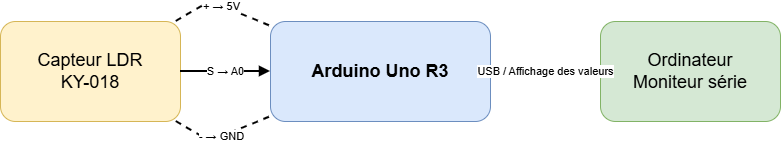

### Diagramme de l'expérimentation 2 
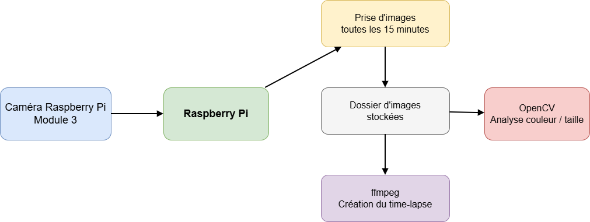

## Sources

1. [Raspberry Pi 4 Model B Specifications](https://www.raspberrypi.com/products/raspberry-pi-4-model-b/specifications/) — Documentation officielle du Raspberry Pi qui décrit les caractéristiques techniques et les capacités de la carte utilisée dans le projet.
2. [Raspberry Pi Camera Module 3](https://www.raspberrypi.com/products/camera-module-3/) — Page officielle présentant les spécifications de la caméra utilisée pour la capture d’images dans le projet.
3. [FFmpeg Documentation](https://ffmpeg.org/documentation.html) — Documentation officielle de ffmpeg expliquant comment traiter des images et créer des vidéos avec les time-lapses.
4. [Picamera2 Manual](https://datasheets.raspberrypi.com/camera/picamera2-manual.pdf) — Manuel officiel de la bibliothèque Picamera2 pour le contrôle de la caméra en Python sur Raspberry Pi.
5. [OpenCV Documentation](https://docs.opencv.org/) — Documentation officielle d'OpenCV utilisée pour l'analyse d'images et la détection de couleurs dans le projet.
